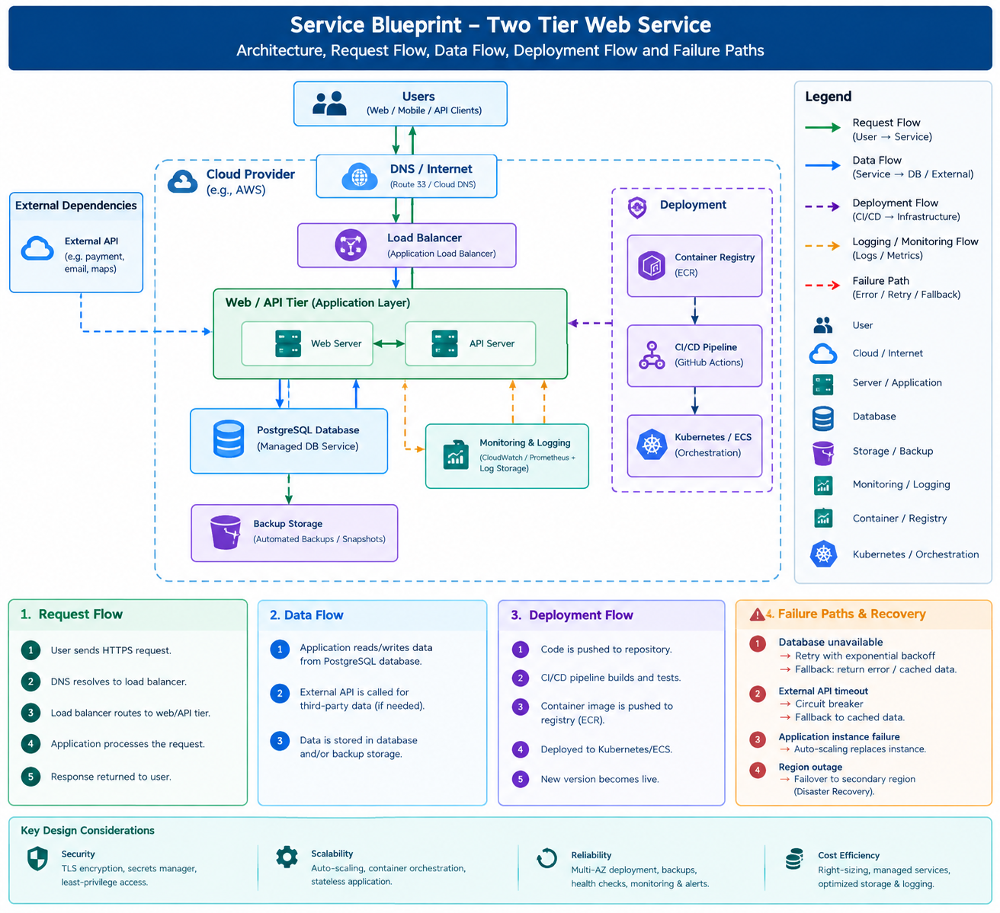

# RabTech Task 02 — Service Blueprint, SLOs & Cloud Cost Envelope

> **Operational design for a small two-tier web service before infrastructure deployment.**

---

## 1. Project Overview

This project defines the operational contract for a small two-tier web service before selecting infrastructure or implementing deployment automation.

The design covers:

- Service architecture and request flow
- Application and database data flow
- Deployment flow
- External dependencies
- Failure and recovery paths
- Service Level Indicators (SLIs)
- Service Level Objectives (SLOs)
- Error budgets
- Alerting and paging thresholds
- Three traffic and cost scenarios
- Recovery objectives
- Secrets management
- Least-privilege access
- Architecture Decision Records (ADRs)

---

# 2. Service Architecture



The service uses a two-tier architecture.

### Tier 1 — Web/API Application Tier

The application tier:

- Receives HTTPS requests
- Processes business logic
- Reads and writes application data
- Communicates with approved external APIs
- Provides health-check endpoints
- Produces application logs and metrics
- Can scale horizontally when required

### Tier 2 — Managed PostgreSQL Data Tier

The database tier:

- Stores persistent application data
- Is accessible only by the application tier
- Uses automated backups and snapshots
- Supports recovery according to the selected scenario

### Supporting Services

The architecture also includes:

- DNS
- Load balancing
- Container registry
- CI/CD pipeline
- Monitoring and logging
- Backup storage
- External API dependencies

---

# 3. Request Flow

The normal request path is:

```text
User
  |
  | HTTPS Request
  v
DNS / Internet
  |
  v
Load Balancer
  |
  v
Web / API Tier
  |
  +-------> PostgreSQL Database
  |
  +-------> External API
  |
  v
Response
  |
  v
User
Request Sequence
User sends an HTTPS request.
DNS resolves the public service endpoint.
Load balancer receives the request.
Load balancer forwards the request to a healthy application instance.
The application processes the request.
The application reads or writes PostgreSQL data when required.
The application calls an external dependency when required.
The response is returned to the user.
4. Data Flow

The primary data path is:

Web/API Tier
     |
     | Read / Write
     v
PostgreSQL Database
     |
     | Automated Backup
     v
Backup Storage

External dependency flow:

Web/API Tier
     |
     | API Request
     v
External API
     |
     | API Response
     v
Web/API Tier

Observability flow:

Application + Infrastructure
          |
          | Logs / Metrics
          v
Monitoring & Logging
5. Deployment Flow

The deployment process is:

Developer
    |
    v
Source Repository
    |
    v
CI/CD Pipeline
    |
    +--> Tests
    |
    +--> Build Container
    |
    v
Container Registry
    |
    v
Container Orchestration
    |
    v
Application Tier
    |
    v
Health Checks
    |
    v
Traffic Enabled
Deployment Steps
Developer pushes code to the repository.
CI/CD performs validation and tests.
A container image is built.
The image is pushed to a container registry.
The deployment platform starts the new version.
Health checks verify application readiness.
Traffic is shifted to healthy instances.
6. External Dependencies

The Web/API tier may communicate with approved third-party services such as:

Payment services
Email services
Maps or location services
Authentication providers
Other required APIs

External dependencies are protected using:

Explicit request timeouts
Limited retries
Exponential backoff
Circuit-breaker behavior where appropriate
Cached or degraded responses when possible

The application should not depend indefinitely on an unavailable external service.

7. Failure and Recovery
Failure	Detection	Recovery
Database unavailable	Health checks and connection errors	Retry with backoff, fail gracefully and restore/fail over
External API timeout	Timeout/error metrics	Timeout, retry when safe, circuit breaker and fallback
Application instance failure	Load-balancer health checks	Remove unhealthy instance and replace/scale
Regional outage	External monitoring	Recovery/failover according to RTO

Detailed recovery procedures are documented in:

Failure and Recovery

8. Database Failure

If the PostgreSQL database becomes unavailable:

Application health checks detect the problem.
Database connection failures are recorded in application metrics.
Safe operations may be retried using exponential backoff.
Retry storms are avoided through bounded retries.
The application returns a controlled error if the database remains unavailable.
Database recovery or failover is performed according to the selected scenario.
Application health is verified before normal traffic resumes.
9. Application Instance Failure

If an application instance fails:

Application Instance
        X
        |
        v
Load Balancer
        |
        v
Healthy Application Instance

The load balancer detects the unhealthy instance through health checks.

The unhealthy instance is removed from traffic and replaced or restarted.

For higher traffic scenarios, additional instances can be started automatically.

10. External API Failure

If an external API becomes unavailable:

The application uses an explicit timeout.
Safe/idempotent operations may be retried.
Exponential backoff prevents excessive requests.
A circuit breaker can stop repeated calls during prolonged failure.
Cached or fallback information can be returned when possible.
The failure is recorded in monitoring and logging systems.

This prevents an external dependency failure from unnecessarily bringing down the entire application.

11. Regional Failure

Regional failure is handled differently for each scenario.

Lean

The Lean design prioritizes low cost.

Recovery target:

RPO: 24 hours
RTO: 4 hours

Recovery can involve restoring the application and database in a recovery environment.

Balanced

The Balanced design provides stronger recovery capability.

Recovery target:

RPO: 60 minutes
RTO: 60 minutes

More frequent backups and recovery-ready infrastructure are required.

Resilient

The Resilient design provides the strongest reliability target.

Recovery target:

RPO: 15 minutes
RTO: 30 minutes

Multi-zone deployment, frequent backups and a tested regional recovery process are required.

12. Service Level Objectives

The three scenarios use different availability and latency targets.

Metric	Lean	Balanced	Resilient
Availability	99.0%	99.5%	99.9%
P95 API Latency	<800 ms	<500 ms	<300 ms
RPO	24 hours	60 minutes	15 minutes
RTO	4 hours	60 minutes	30 minutes

Additional operational targets:

Metric	Target
Error Rate	<1%
Database Availability	≥99.9%
Backup Success	≥99%
13. Service Level Indicators

The following SLIs are used to measure service health.

Availability SLI
Successful Requests
-------------------- × 100
Total Requests
Latency SLI

Measured using the 95th percentile (P95) response latency.

Error Rate SLI
5xx Responses
------------- × 100
Total Responses

Client-side expected 4xx responses are not treated as application failures for the primary error-rate SLI.

Database Availability SLI

Measured using successful database health checks compared with total health checks.

Backup SLI

Measured as:

Successful Backups
------------------ × 100
Scheduled Backups
14. Error Budget

An error budget represents the amount of unavailability allowed by the availability SLO.

For a 30-day month:

Lean — 99.0%

Allowed unavailability:

432 minutes

Balanced — 99.5%

Allowed unavailability:

216 minutes

Resilient — 99.9%

Allowed unavailability:

43.2 minutes

The higher the availability target, the smaller the available error budget.

If the service consumes too much of its error budget, reliability work should take priority over risky feature releases.

15. Alerting and Paging
Metric	Warning	Critical / Page
Availability	Below target	<99.0% for 5 minutes
Error Rate	>2% for 10 minutes	>5% for 5 minutes
P95 Latency	Above scenario target	Above target for 10 minutes
Database Health	Repeated failures	3 consecutive failed checks
Backup	One missed backup	Two consecutive missed backups
Alert Severity

Warning

Used for conditions that require investigation but do not necessarily require immediate human intervention.

Critical

Used for conditions that threaten the SLO and require immediate engineer attention.

16. Cloud Cost Envelope

Three scenarios were evaluated using the supplied monthly budget envelopes.

Scenario	Monthly Budget	Availability	P95 Latency	RPO	RTO
Lean	₹2,500	99.0%	<800 ms	24 hr	4 hr
Balanced	₹8,000	99.5%	<500 ms	60 min	60 min
Resilient	₹25,000	99.9%	<300 ms	15 min	30 min

The cost model considers:

Compute
Managed database
Storage
Data transfer
Logging and monitoring
Backup
Support and contingency

See:

Cloud Cost Model

17. Cost Model Approach

The supplied monthly scenario budgets are allocated across the major infrastructure categories.

Lean

Focus:

Minimum infrastructure cost
Basic application hosting
Managed database
Basic monitoring and backups

Trade-off:

Lower redundancy
Longer recovery time
Larger regional failure risk
Balanced

Focus:

Balance between reliability and cost
Managed database
Application scaling
Improved monitoring
More frequent backups

Trade-off:

Higher cost than Lean
More infrastructure complexity
Resilient

Focus:

Strong availability
Faster recovery
Higher redundancy
Frequent backups
Stronger monitoring

Trade-off:

Highest infrastructure and operational cost
18. Security Design

The architecture follows basic cloud security principles.

Transport Security

All external communication uses HTTPS/TLS.

Secrets Management

Database credentials, API keys and other sensitive configuration are stored outside source code using a managed secrets/configuration service.

Secrets should never be committed to Git.

Least Privilege

Application identities receive only the permissions required to perform their functions.

For example:

Application
     |
     +---- Read/Write application database
     |
     +---- Read required secrets
     |
     X---- No administrator permissions
Database Access

The database is not directly exposed to users.

Only the application tier should have database access.

Backup Protection

Database backups are stored separately from application instances to reduce the impact of infrastructure failure.

19. Recovery Objectives

Recovery objectives vary by scenario.

Scenario	RPO	RTO	Reliability Approach
Lean	24 hours	4 hours	Basic backup and recovery
Balanced	60 minutes	60 minutes	Frequent backups and recovery-ready infrastructure
Resilient	15 minutes	30 minutes	Strong redundancy and tested recovery/failover
RPO — Recovery Point Objective

RPO defines the maximum acceptable amount of data loss measured in time.

Example:

A 15-minute RPO means the service should aim to recover with no more than approximately 15 minutes of data loss.

RTO — Recovery Time Objective

RTO defines the target time to restore service after a major failure.

Example:

A 30-minute RTO means the Resilient scenario targets service restoration within 30 minutes.

20. Architecture Decisions

The major architecture decisions are documented separately as ADRs.

ADR-001 — Cloud Region

Defines the regional deployment strategy and the trade-off between cost and resilience.

View ADR-001

ADR-002 — Managed PostgreSQL Database

Defines the decision to use a managed relational database.

View ADR-002

ADR-003 — Secrets Management

Defines how database credentials and API keys are securely managed.

View ADR-003

ADR-004 — Least-Privilege Access

Defines the access-control strategy for application and infrastructure components.

View ADR-004

ADR-005 — Recovery Objectives

Documents the scenario-specific RPO and RTO decisions.

View ADR-005

21. Monitoring and Observability

The service should monitor:

Application Metrics
Request count
Response latency
HTTP error rate
Active requests
Application health
Database Metrics
Connection failures
CPU utilization
Storage utilization
Connection count
Query performance
Backup status
Infrastructure Metrics
Instance health
CPU utilization
Memory utilization
Network traffic
Load-balancer health
Logs

Application and infrastructure logs should be centralized for troubleshooting and operational analysis.

22. Health Checks

The application should expose a lightweight health endpoint.

Example:

GET /health

Expected response:

HTTP 200 OK

A deeper readiness check may verify required dependencies before an instance receives traffic.

Health checks are used by the load balancer and deployment system to prevent unhealthy instances from serving users.

23. Scalability

The Web/API tier is designed to scale horizontally.

                Load Balancer
                     |
          +----------+----------+
          |          |          |
          v          v          v
       App 1      App 2      App 3
          |          |          |
          +----------+----------+
                     |
                     v
                PostgreSQL

This allows additional application instances to be added when traffic increases.

The database remains the primary persistent data store.

24. Design Principles

The architecture follows these principles:

Reliability

Use health checks, backups, monitoring and controlled failure handling.

Scalability

Keep the application tier as stateless as practical and scale application instances horizontally.

Security

Use TLS, managed secrets and least-privilege access.

Observability

Collect metrics, logs and alerts for critical service components.

Cost Efficiency

Match infrastructure redundancy and recovery capability to the selected scenario.

Simplicity

Avoid unnecessary infrastructure complexity for a small service.

25. Assumptions

The scenario inputs supplied for this task are:

Lean: ₹2,500/month, 99.0% availability, P95 <800 ms, RPO 24 hours, RTO 4 hours.
Balanced: ₹8,000/month, 99.5% availability, P95 <500 ms, RPO 60 minutes, RTO 60 minutes.
Resilient: ₹25,000/month, 99.9% availability, P95 <300 ms, RPO 15 minutes, RTO 30 minutes.

Exact requests-per-second or monthly request counts were not provided.

Therefore, the cost model uses the supplied scenario budgets rather than inventing precise traffic volumes.

The cloud cost model is a planning estimate rather than a provider invoice.

Exact cloud pricing should be recalculated using the selected provider's current pricing calculator before production deployment.

See:

Assumptions

26. Repository Structure
rabtech-service-blueprint-slo-cost-envelope/
│
├── README.md
│
├── architecture/
│   ├── service-blueprint.png
│   └── service-blueprint.md
│
├── slo/
│   └── slo-workbook.xlsx
│
├── cost-model/
│   └── cloud-cost-model.xlsx
│
├── adr/
│   ├── ADR-001-cloud-region.md
│   ├── ADR-002-database.md
│   ├── ADR-003-secrets-management.md
│   ├── ADR-004-least-privilege.md
│   └── ADR-005-recovery-objectives.md
│
├── docs/
│   ├── failure-recovery.md
│   └── assumptions.md
│
└── .gitignore
27. Task Completion Checklist

The following deliverables have been completed for RabTech Task 02:

 Two-tier service architecture
 Service blueprint
 Request flow
 Dependency flow
 Deployment flow
 Data flow
 Failure paths
 Failure recovery procedures
 Availability SLI
 Availability SLO
 Latency SLI
 Latency SLO
 Error rate target
 Error budget
 Paging thresholds
 Three cost scenarios
 Compute cost
 Database cost
 Storage cost
 Transfer cost
 Logging and monitoring cost
 Backup cost
 Support and contingency
 Recovery Point Objective (RPO)
 Recovery Time Objective (RTO)
 Secrets management
 Least-privilege access
 Monitoring and observability
 Architecture Decision Records
 Assumptions documentation
28. Final Deliverables

This repository contains the complete evidence required for the task:

Deliverable	Location
Service Blueprint	architecture/service-blueprint.png
Architecture Explanation	architecture/service-blueprint.md
SLO Workbook	slo/slo-workbook.xlsx
Cloud Cost Model	cost-model/cloud-cost-model.xlsx
Architecture Decisions	adr/
Failure & Recovery	docs/failure-recovery.md
Assumptions	docs/assumptions.md
Project Documentation	README.md
